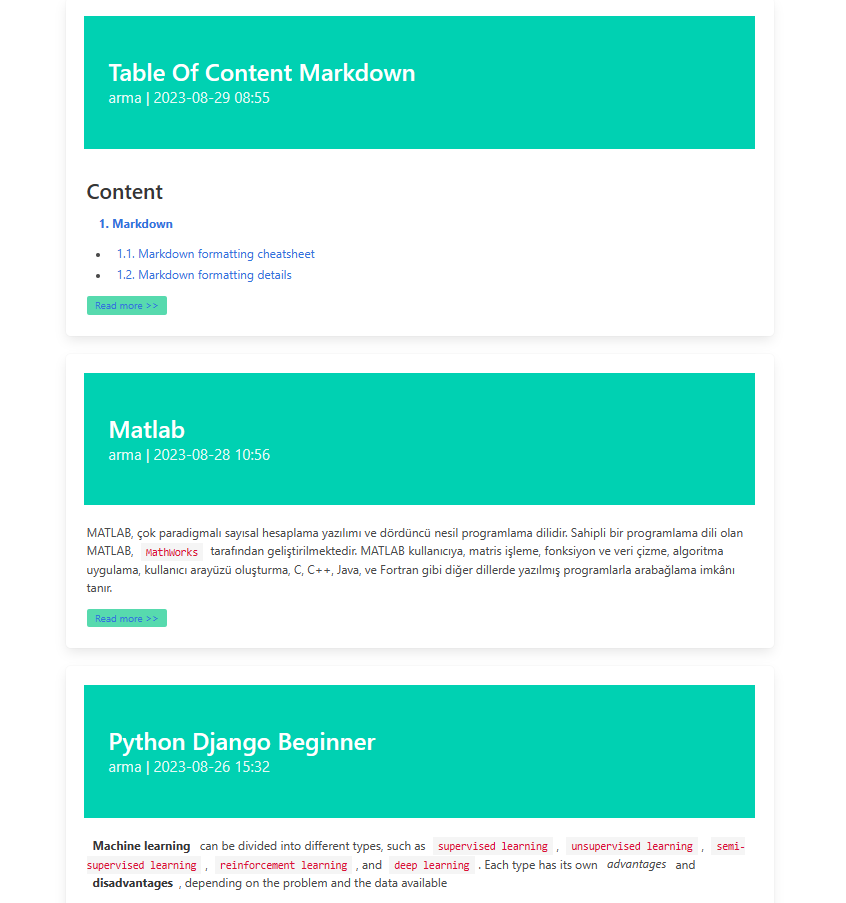

## Here is the sample video
<video src="video/video.mp4" controls title="Title"></video>
***

In this Django project
    : You can use `HTML` or `Markdown` to make your blog post on the **`admin panel`**

- 1. Copy or download the github project and extract it then to the project directory
```sh
cd blog
```
- 2. Create virtual environment
```python -m venv .envblog```

- 3. Activate environment
```.envblog\Scripts\activate```

Once you activated you'll see the `(.envblog)` in the terminal

- 4. Then use this command to download necessary framework
```pip install -r requirements.txt```

- 5. Create admin account
```python manage.py createsuperuser```

---

{width=300 height=300}

---

![This is the caption][image]

[image]: video/admin.PNG height=150px width=150px